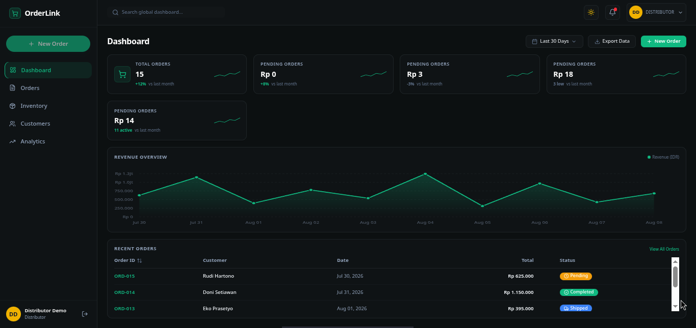

# 🛒 OrderLink

<p align="center">
  
</p>

<p align="center">
  <a href="#-tech-stack">
    
  </a>
  <a href="#-tech-stack">
    
  </a>
  <a href="#-tech-stack">
    
  </a>
  <a href="#-tech-stack">
    
  </a>
</p>

<p align="center">
  <b>OrderLink</b> adalah platform manajemen pesanan real-time berbasis web yang dirancang untuk kecepatan, keandalan, dan kemudahan penggunaan.
</p>

---

## ✨ Fitur Utama

- ⚡ **Real-time Order Tracking**: Pembaruan status pesanan secara langsung tanpa reload menggunakan WebSockets (Socket.IO).
- 🎨 **Modern & Responsive UI**: Tampilan antarmuka yang bersih, intuitif, dan responsif dengan Tailwind CSS.
- 🛡️ **Sistem Autentikasi**: Proteksi akses berbasis peran untuk pengguna dan admin.
- 📊 **Manajemen Pesanan Efisien**: Pengelolaan status transaksi dan histori pesanan yang terintegrasi.
- 🚀 **High Performance Backend**: Layanan API yang handal dan cepat berbasis Node.js & Express.

---

## 🛠️ Tech Stack

<div align="center">

| Layer | Teknologi |
| :--- | :--- |
| **Frontend** | React, TypeScript, Tailwind CSS, Vite |
| **Backend API** | Node.js, Express.js |
| **Realtime Engine** | Socket.IO |
| **Database** | MySQL |
| **Deployment** | Vercel (Frontend), Railway (Backend & DB) |

</div>

---

## 🚀 Panduan Memulai (Local Setup)

### Prasyarat
- **Node.js**: `v18.x` atau lebih baru
- **MySQL**: Server database aktif

### 1. Clone Repositori
```bash
git clone https://github.com/imbran776/orderlink.git
cd orderlink
```

### 2. Instalasi Dependensi
```bash
npm install
```

### 3. Konfigurasi Environment Variables
Buat file `.env` di root project dan sesuaikan datanya:
```env
VITE_API_BASE_URL=http://localhost:5000
VITE_SOCKET_URL=http://localhost:5000
```

### 4. Jalankan Mode Pengembangan
```bash
npm run dev
```

---

## 🌐 Arsitektur Deployment

OrderLink dipisah menjadi komponen independen untuk performa optimal:
- **Frontend**: Deployed di **Vercel** (`orderlink-frontend`)
- **Backend API & Realtime**: Deployed di **Railway** (`orderlink-backend`, `orderlink-realtime`)
- **Database**: Managed **MySQL** di Railway (`orderlink-mysql`)

---

<p align="center">
  Developed with ❤️ by <a href="https://github.com/imbran776">Imbran</a>
</p>
